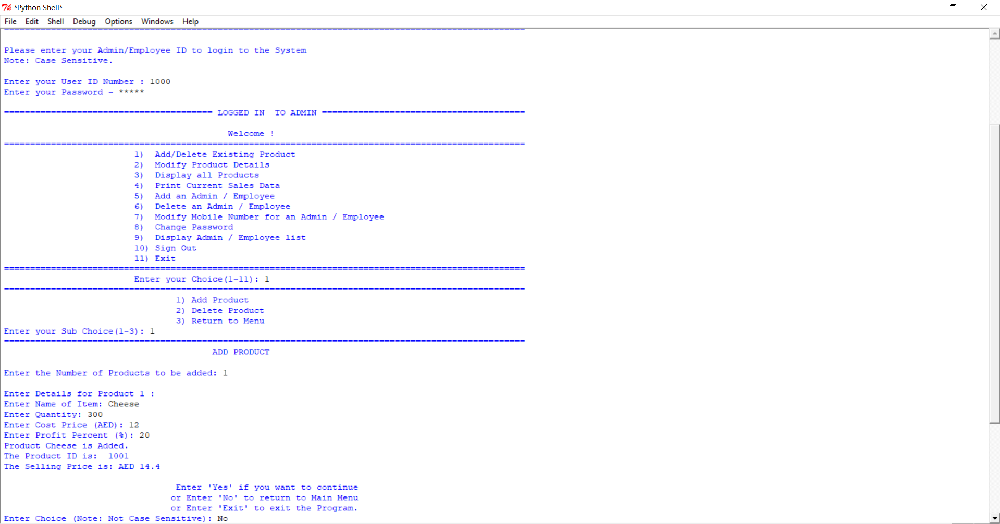

# Our Own Supermarket

Our Own Supermarket is a python based supermarket administration system that handles customer &amp; admin operations. 

The two main parts of the program are:
1) Administrator 
2) Employee 

## Administrator Account

Every supermarket has an administrator who looks after the overall supermarket, and is responsible for setting the Profit Margin, etc. 
The administrator account does just that and allows administrators to log into their admin account by providing their respective Admin ID’s and Password.

The administrator account allows the user to perform five main operations:

### 1. Add/Delete/Modify Products
  
  The admin can add a new product or delete/modify an existing product. Any change through this module automatically modifies the     products database. Adding a new product automatically creates a product ID for it through a special feature of the program known as Serialization.

### 2. Display all products

### 3. Print Current Sales Data

  It allows the administrator to keep track of the profit margins earned. This is useful to understand whether the Supermarket is doing well in its business or not.
### 4. Add/Delete/Modify an Admin/Employee Account

  The administrator has the power to add/delete/modify an admin/employee account. The admin can modify details such as the Name and Mobile Number. 
  However, the admin cannot modify details such as the password of an account. This is because modification of a password requires the existing password. Hence, modification of any account’s password can only be done by the account holder via the admin account.
  
### 5. Display Admin/Employee Accounts

  This module allows the administrator to view all the admin & employee accounts. However, this does not allow the administrator to view  the passwords of the admin & employee accounts.
  Admin ID’s always begins with the digit “1”, and always has 4 digits. 
  The maximum number of Administrator Accounts the Supermarket can have is 999.
  By default, an initial Admin account is always there:
	Admin ID : 1000
	Password : *****

## Employee Account:
  An employee can log into the employee account by providing the particular employee id and password.
  Once an employee logs in, the employee can perform two main operations:

### 1. Buy Product

  This allows the employee to conduct purchases for a customer by scanning a barcode / entering the Product ID of the desired product. 
  After the purchase is conducted, the system automatically prints a bill, and it also automatically deducts the quantity of the purchased products from the Products Database.
  
### 2. Display all products

  An employee does not need to know unnecessary details, such as Cost Price & Profit Percentage. Hence, the software does not show these unnecessary data. It only shows the Product ID, Product Name, Quantity, and Selling Price. 
  Employee Accounts are managed by administrators and hence, any modification in an employee account can only be done via an administrator account.
  Employee ID’s always begins with the digit “2”, and always has 4 digits. 
  The maximum number of Employee Accounts the Supermarket can have is 999.
  By default, an initial employee account is always there:
    Employee ID : 2000
    Password : *****

## Special Features of the Program:

  1)	**Serialization:**
  We have designed a unique code which automatically generates a new ID number for every product/admin/employee to be added. 
  Serialization also ensures that the same code is not assigned for a previously existing product/admin/employee.

  2)	**Error Handling:**
  Our program is extremely error-free and has handled all sorts of errors. As a result, there is no possible way for an unexpected termination of the program to occur. 
  The only way the user can terminate the program, is by selecting the “Exit” option.
  The program also displays appropriate error messages and gives the user a chance to correct his input.
  This makes our program extremely user friendly and easy to understand.

  3)	**User-Friendly:**
  Our program is extremely user-friendly as it has self-explanatory menu and setup options. 
  The program is not case-sensitive and hence users don’t need to worry about the case of their input. 
  (This is in case of the “Yes” or “No” input options)
